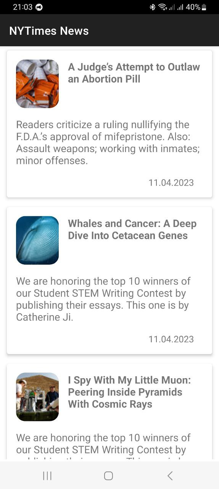
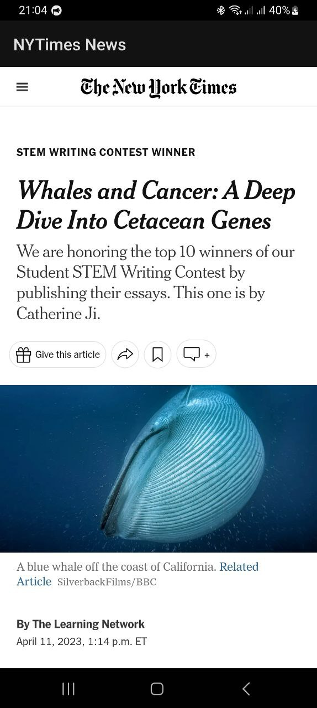
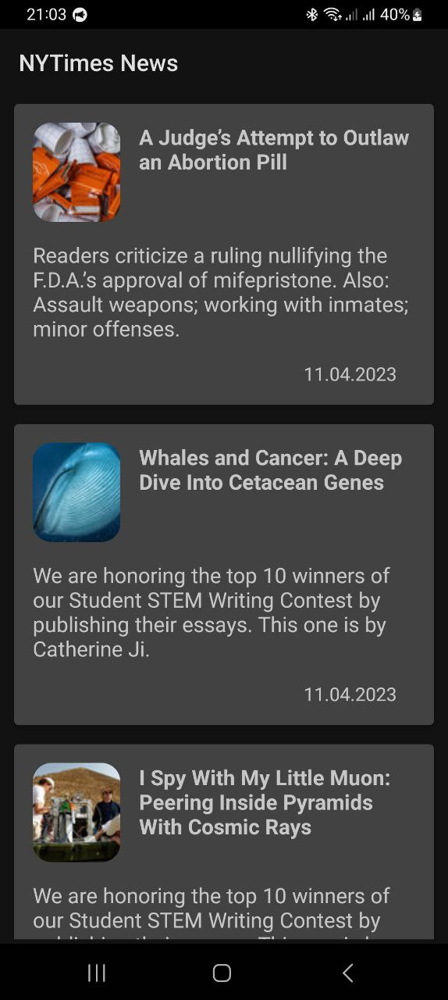

# NYTimes News Android App

This is a pet project app with access to the NY Times Articles API and displaying a list of articles. Clicking on an article will display the full article. The app supports dark mode. The application works offline if the articles have been downloaded before.

Application implements MVVM architecture using Dagger Hilt, Retrofit, Coroutines, Glide, Kotlin Flow, Room Database, Cicerone.

Unit tests are implemented using JUnit, MockK.

<br>
<p align="center">
    
    
    
</p>
<br>

## License
```
   Copyright (C) 2023 Yaroslav Yasinskyi

   Licensed under the Apache License, Version 2.0 (the "License");
   you may not use this file except in compliance with the License.
   You may obtain a copy of the License at

       http://www.apache.org/licenses/LICENSE-2.0

   Unless required by applicable law or agreed to in writing, software
   distributed under the License is distributed on an "AS IS" BASIS,
   WITHOUT WARRANTIES OR CONDITIONS OF ANY KIND, either express or implied.
   See the License for the specific language governing permissions and
   limitations under the License.
```
